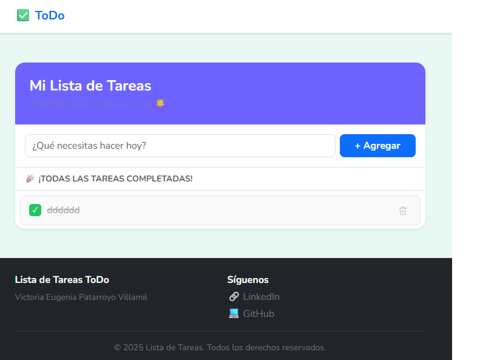

# ✅ ToDo — Task List App


A clean and friendly task management web application built with **Bootstrap 5** and **Vanilla JavaScript**. Users can add, complete, and delete tasks — with real-time feedback and a smooth, responsive interface.

> 🔗 **Repository:** [github.com/victoriapatarroyo/ToDoBoostrap](https://github.com/victoriapatarroyo/ToDoBoostrap)

---

## 📸 Preview



---

## ✨ Features

- ➕ Add new tasks by clicking **Agregar** or pressing **Enter**
- ✅ Mark tasks as completed with a checkbox
- 🗑️ Delete tasks with an animated trash icon
- 📊 Live counter showing pending tasks
- 📋 Empty state message when the list is clear
- 🔔 Floating alerts confirming actions (success / error)
- 📱 Fully responsive layout using Bootstrap 5

---

## 🚀 Getting Started

### 1. Clone the repository

```bash
git clone https://github.com/victoriapatarroyo/ToDoBoostrap.git
cd ToDoBoostrap
```

### 2. Open in your browser

```
Open index.html directly in any modern browser.
```

No installation, no backend, no dependencies required.

---

## 🗂️ Project Structure

```
todo-app/
│
├── index.html       # Main HTML structure
├── estilos.css      # Custom styles (complement Bootstrap)
├── script.js        # App logic and DOM manipulation
└── images/
    └── preview.png  # App screenshot
```

---

## 🏗️ Tech Stack

| Technology | Purpose |
|---|---|
| HTML5 | Page structure |
| CSS3 + Bootstrap 5 | Styling and responsive layout |
| Vanilla JavaScript ES6 | App logic and interactivity |
| DOM API | Dynamic element creation |
| Google Fonts (Nunito) | Typography |

---

## ⚙️ How It Works

1. User types a task in the input field
2. Clicks **Agregar** or presses **Enter**
3. The app validates the input (empty fields are rejected)
4. A new task row is added to the list dynamically
5. Each task has a **checkbox** to mark it as done and a **trash icon** to delete it
6. The pending task counter updates automatically
7. A floating alert confirms every action

---

## 🧠 Key Concepts Applied

- DOM manipulation with **Vanilla JavaScript**
- Event-driven programming (`click`, `keypress`)
- Dynamic component creation with `createElement`
- CSS class toggling for state management (`.done`, `.visible`)
- Responsive UI with **Bootstrap 5 grid and utilities**
- Custom styles layered on top of Bootstrap

---

## 🔮 Future Improvements

- [ ] Persist tasks using **LocalStorage**
- [ ] Edit existing tasks inline
- [ ] Filter tasks by status (All / Pending / Completed)
- [ ] Drag and drop to reorder tasks
- [ ] Dark mode toggle
- [ ] Export task list as PDF or text file

---

## 👩‍💻 Author

**Victoria Eugenia Patarroyo Villamil**
Aspiring Full Stack Developer building practical and scalable web applications.

[](https://github.com/victoriapatarroyo)
[](https://www.linkedin.com/in/victoriaeugeniapatarroyo/)

---

## 📄 License

This project is licensed under the **MIT License** — feel free to use, modify, and share it.
